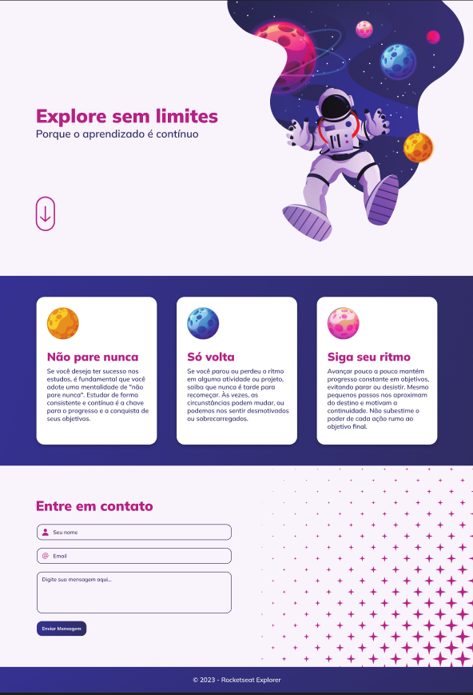

# JavaScript | Explorer Intensivão II

### Essa tarefa faz parte do curso Explorer da [Rocketseat](https://www.rocketseat.com.br).

Nessa atividade foram abordadas as seguintes questões:

- Variáveis no CSS;
- Mobile first;
- Aplicação da responsividade;
- Criação de funções;
- Uso do Alert;

## 🔖 Layout 

## 👩‍💻 Demonstração

No seguinte link está disponível uma visualização do atividade em funcionamento: [Clique Aqui!](<https://www.linkedin.com/feed/update/urn:li:activity:7106031445856415745/?originTrackingId=2x7tQC9AQWOPajCy%2BCy05g%3D%3D>)